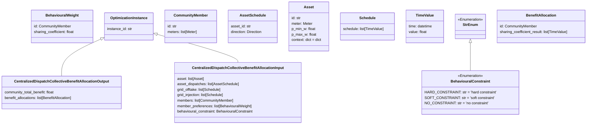

```mermaid
classDiagram

    class BehaviouralConstraint {
        <<Enumeration>>
        HARD_CONSTRAINT: str = 'hard constraint'
        SOFT_CONSTRAINT: str = 'soft constraint'
        NO_CONSTRAINT: str = 'no constraint'
    }

    class BehaviouralWeight {
        id: CommunityMember
        sharing_coefficient: float
    }

    class OptimizationInstance {
        instance_id: str
    }

    class CommunityMember {
        id: str
        meters: list[Meter]
    }

    class AssetSchedule {
        asset_id: str
        direction: Direction
    }

    class Asset {
        id: str
        meter: Meter
        p_min_w: float
        p_max_w: float
        context: dict = dict
    }

    class Schedule {
        schedule: list[TimeValue]
    }

    class TimeValue {
        time: datetime
        value: float
    }

    class StrEnum {
        <<Enumeration>>
    }

    class BenefitAllocation {
        id: CommunityMember
        sharing_coefficient_result: list[TimeValue]
    }

    class CentralizedDispatchCollectiveBenefitAllocationOutput {
        community_total_benefit: float
        benefit_allocations: list[BenefitAllocation]
    }

    class CentralizedDispatchCollectiveBenefitAllocationInput {
        asset: list[Asset]
        asset_dispatches: list[AssetSchedule]
        grid_offtake: list[Schedule]
        grid_injection: list[Schedule]
        members: list[CommunityMember]
        member_preferences: list[BehaviouralWeight]
        behavioural_constraint: BehaviouralConstraint
    }


    StrEnum <|-- BehaviouralConstraint
    OptimizationInstance <|-- CentralizedDispatchCollectiveBenefitAllocationOutput
    OptimizationInstance <|-- CentralizedDispatchCollectiveBenefitAllocationInput

```