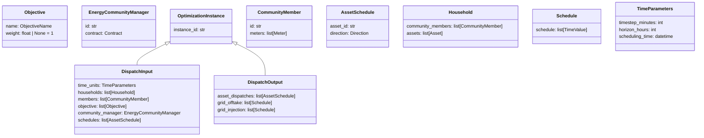

```mermaid
classDiagram

    class DispatchInput {
        time_units: TimeParameters
        households: list[Household]
        members: list[CommunityMember]
        objective: list[Objective]
        community_manager: EnergyCommunityManager
        schedules: list[AssetSchedule]
    }

    class Objective {
        name: ObjectiveName
        weight: float | None = 1
    }

    class EnergyCommunityManager {
        id: str
        contract: Contract
    }

    class OptimizationInstance {
        instance_id: str
    }

    class CommunityMember {
        id: str
        meters: list[Meter]
    }

    class AssetSchedule {
        asset_id: str
        direction: Direction
    }

    class Household {
        community_members: list[CommunityMember]
        assets: list[Asset]
    }

    class Schedule {
        schedule: list[TimeValue]
    }

    class TimeParameters {
        timestep_minutes: int
        horizon_hours: int
        scheduling_time: datetime
    }

    class DispatchOutput {
        asset_dispatches: list[AssetSchedule]
        grid_offtake: list[Schedule]
        grid_injection: list[Schedule]
    }


    OptimizationInstance <|-- DispatchInput
    OptimizationInstance <|-- DispatchOutput

```