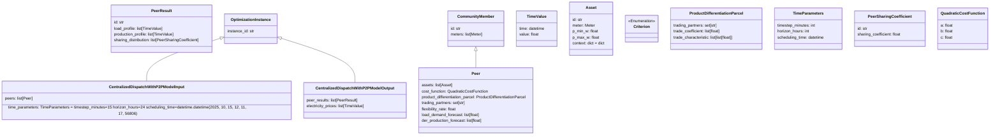

```mermaid
classDiagram

    class PeerResult {
        id: str
        load_profile: list[TimeValue]
        production_profile: list[TimeValue]
        sharing_distribution: list[PeerSharingCoefficient]
    }

    class CentralizedDispatchWithP2PModelOutput {
        peer_results: list[PeerResult]
        electricity_prices: list[TimeValue]
    }

    class OptimizationInstance {
        instance_id: str
    }

    class CommunityMember {
        id: str
        meters: list[Meter]
    }

    class TimeValue {
        time: datetime
        value: float
    }

    class Asset {
        id: str
        meter: Meter
        p_min_w: float
        p_max_w: float
        context: dict = dict
    }

    class Criterion {
        <<Enumeration>>
    }

    class CentralizedDispatchWithP2PModelInput {
        time_parameters: TimeParameters = timestep_minutes=15 horizon_hours=24 scheduling_time=datetime.datetime(2025, 10, 15, 12, 11, 17, 56806)
        peers: list[Peer]
    }

    class ProductDifferentiationParcel {
        trading_partners: set[str]
        trade_coefficient: list[float]
        trade_characteristic: list[list[float]]
    }

    class Peer {
        assets: list[Asset]
        cost_function: QuadraticCostFunction
        product_differentiation_parcel: ProductDifferentiationParcel
        trading_partners: set[str]
        flexibility_rate: float
        load_demand_forecast: list[float]
        der_production_forecast: list[float]
    }

    class TimeParameters {
        timestep_minutes: int
        horizon_hours: int
        scheduling_time: datetime
    }

    class PeerSharingCoefficient {
        id: str
        sharing_coefficient: float
    }

    class QuadraticCostFunction {
        a: float
        b: float
        c: float
    }


    CommunityMember <|-- Peer
    OptimizationInstance <|-- CentralizedDispatchWithP2PModelInput
    OptimizationInstance <|-- CentralizedDispatchWithP2PModelOutput

```