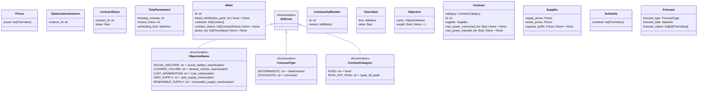

```mermaid
classDiagram

    class Prices {
        prices: list[TimeValue]
    }

    class OptimizationInstance {
        instance_id: str
    }

    class ContractShare {
        contract_id: str
        share: float
    }

    class ForecastType {
        <<Enumeration>>
        DETERMINISTIC: str = 'deterministic'
        STOCHASTIC: str = 'stochastic'
    }

    class ObjectiveName {
        <<Enumeration>>
        SOCIAL_WELFARE: str = 'social_welfare_maximisation'
        CLEARED_VOLUME: str = 'cleared_volume_maximisation'
        COST_MINIMISATION: str = 'cost_minimisation'
        GRID_SUPPLY: str = 'grid_supply_minimisation'
        RENEWABLE_SUPPLY: str = 'renewable_supply_maximisation'
    }

    class TimeParameters {
        timestep_minutes: int
        horizon_hours: int
        scheduling_time: datetime
    }

    class Meter {
        id: str
        linked_distribution_point: str | None = None
        contracts: list[Contract]
        contract_shares: list[ContractShare] | None = None
        power_kw: list[TimeValue] | None = None
    }

    class StrEnum {
        <<Enumeration>>
    }

    class CommunityMember {
        id: str
        meters: list[Meter]
    }

    class TimeValue {
        time: datetime
        value: float
    }

    class Objective {
        name: ObjectiveName
        weight: float | None = 1
    }

    class Contract {
        category: ContractCategory
        id: str
        supplier: Supplier
        max_power_consumed_kw: float | None = None
        max_power_injected_kw: float | None = None
    }

    class Supplier {
        supply_prices: Prices
        resale_prices: Prices
        capacity_tariffs: Prices | None = None
    }

    class Schedule {
        schedule: list[TimeValue]
    }

    class Forecast {
        forecast_type: ForecastType
        forecast_date: datetime
        forecast_values: list[list[TimeValue]]
    }

    class ContractCategory {
        <<Enumeration>>
        FIXED: str = 'fixed'
        PEAK_OFF_PEAK: str = 'peak_off_peak'
    }


    StrEnum <|-- ObjectiveName
    StrEnum <|-- ForecastType
    StrEnum <|-- ContractCategory

```