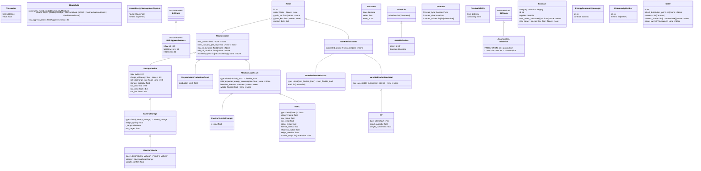

```mermaid
classDiagram

    class TimeValue {
        time: datetime
        value: float
    }

    class StorageDevice {
        max_cycles: int
        charge_efficiency: float | None = 1.0
        self_discharge_rate: float | None = 0.0
        storage_capacity: float
        soc_min: float = 0.0
        soc_max: float = 1.0
        soc_init: float = 0.0
    }

    class BatteryStorage {
        type: Literal['battery_storage'] = 'battery_storage'
        weight_cycling: float
        t_target: datetime
        soc_target: float
    }

    class Household {
        community_members: list[CommunityMember]
        assets: list[PV | BatteryStorage | ElectricVehicle | HVAC | NonFlexibleLoadAsset | FlexibleLoadAsset]
        risk_aggressiveness: RiskAggressiveness = 50
    }

    class DispatchableProductionAsset {
        production_cost: float
    }

    class FlexibleAsset {
        auto_control: bool | None = None
        ramp_rate_kw_per_step: float | None = None
        min_on_duration: float | None = None
        min_off_duration: float | None = None
        availability_flex: list[FlexAvailability] | None = None
    }

    class HouseEnergyManagementSystem {
        house: Household
        meters: list[Meter]
    }

    class StrEnum {
        <<Enumeration>>
    }

    class RiskAggressiveness {
        <<Enumeration>>
        LOW: int = 20
        MEDIUM: int = 50
        HIGH: int = 80
    }

    class Asset {
        id: str
        meter: Meter | None = None
        p_min_kw: float | None = None
        p_max_kw: float | None = None
        context: dict = dict
    }

    class SocValue {
        time: datetime
        value: float
        asset_id: str
    }

    class IntEnum {
        <<Enumeration>>
    }

    class FlexibleLoadAsset {
        type: Literal['flexible_load'] = 'flexible_load'
        total_expected_energy_consumption: float | None = None
        baseline_forecast: Forecast | None = None
        weight_flexible: float | None = None
    }

    class AssetSchedule {
        asset_id: str
        direction: Direction
    }

    class Forecast {
        forecast_type: ForecastType
        forecast_date: datetime
        forecast_values: list[list[TimeValue]]
    }

    class FlexAvailability {
        time: datetime
        availability: bool
    }

    class NonFlexibleAsset {
        forecasted_profile: Forecast | None = None
    }

    class NonFlexibleLoadAsset {
        type: Literal['non_flexible_load'] = 'non_flexible_load'
        load: list[TimeValue]
    }

    class Schedule {
        schedule: list[TimeValue]
    }

    class Direction {
        <<Enumeration>>
        PRODUCTION: str = 'production'
        CONSUMPTION: str = 'consumption'
    }

    class HVAC {
        type: Literal['hvac'] = 'hvac'
        setpoint_temp: float
        max_temp: float
        min_temp: float
        indoor_temp: float
        thermal_inertia: float
        efficiency_factor: float
        weight_comfort: float
        outdoor_temp: list[TimeValue] = list
    }

    class ElectricVehicle {
        type: Literal['electric_vehicle'] = 'electric_vehicle'
        charger: ElectricVehicleCharger
        weight_comfort: float
    }

    class PV {
        type: Literal['pv'] = 'pv'
        rated_capacity: float
        weight_curtailment: float
    }

    class Contract {
        category: ContractCategory
        id: str
        supplier: Supplier
        max_power_consumed_kw: float | None = None
        max_power_injected_kw: float | None = None
    }

    class EnergyCommunityManager {
        id: str
        contract: Contract
    }

    class CommunityMember {
        id: str
        meters: list[Meter]
    }

    class Meter {
        id: str
        linked_distribution_point: str | None = None
        contracts: list[Contract]
        contract_shares: list[ContractShare] | None = None
        power_kw: list[TimeValue] | None = None
    }

    class ElectricVehicleCharger {
        c_max: float
    }

    class VariableProductionAsset {
        max_acceptable_curtailment_rate: int | None = None
    }


    Asset <|-- FlexibleAsset
    Asset <|-- NonFlexibleAsset
    FlexibleAsset <|-- StorageDevice
    FlexibleAsset <|-- DispatchableProductionAsset
    FlexibleAsset <|-- FlexibleLoadAsset
    NonFlexibleAsset <|-- NonFlexibleLoadAsset
    NonFlexibleAsset <|-- VariableProductionAsset
    IntEnum <|-- RiskAggressiveness
    StrEnum <|-- Direction
    Schedule <|-- AssetSchedule
    StorageDevice <|-- BatteryStorage
    FlexibleLoadAsset <|-- ElectricVehicleCharger
    FlexibleLoadAsset <|-- HVAC
    BatteryStorage <|-- ElectricVehicle
    VariableProductionAsset <|-- PV

```