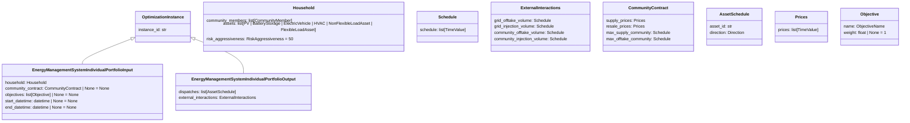

```mermaid
classDiagram

    class OptimizationInstance {
        instance_id: str
    }

    class Household {
        community_members: list[CommunityMember]
        assets: list[PV | BatteryStorage | ElectricVehicle | HVAC | NonFlexibleLoadAsset | FlexibleLoadAsset]
        risk_aggressiveness: RiskAggressiveness = 50
    }

    class Schedule {
        schedule: list[TimeValue]
    }

    class EnergyManagementSystemIndividualPortfolioInput {
        household: Household
        community_contract: CommunityContract | None = None
        objectives: list[Objective] | None = None
        start_datetime: datetime | None = None
        end_datetime: datetime | None = None
    }

    class ExternalInteractions {
        grid_offtake_volume: Schedule
        grid_injection_volume: Schedule
        community_offtake_volume: Schedule
        community_injection_volume: Schedule
    }

    class CommunityContract {
        supply_prices: Prices
        resale_prices: Prices
        max_supply_community: Schedule
        max_offtake_community: Schedule
    }

    class AssetSchedule {
        asset_id: str
        direction: Direction
    }

    class EnergyManagementSystemIndividualPortfolioOutput {
        dispatches: list[AssetSchedule]
        external_interactions: ExternalInteractions
    }

    class Prices {
        prices: list[TimeValue]
    }

    class Objective {
        name: ObjectiveName
        weight: float | None = 1
    }


    OptimizationInstance <|-- EnergyManagementSystemIndividualPortfolioInput
    OptimizationInstance <|-- EnergyManagementSystemIndividualPortfolioOutput

```