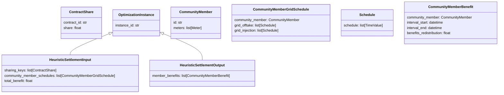

```mermaid
classDiagram

    class ContractShare {
        contract_id: str
        share: float
    }

    class OptimizationInstance {
        instance_id: str
    }

    class HeuristicSettlementInput {
        sharing_keys: list[ContractShare]
        community_member_schedules: list[CommunityMemberGridSchedule]
        total_benefit: float
    }

    class CommunityMember {
        id: str
        meters: list[Meter]
    }

    class HeuristicSettlementOutput {
        member_benefits: list[CommunityMemberBenefit]
    }

    class CommunityMemberGridSchedule {
        community_member: CommunityMember
        grid_offtake: list[Schedule]
        grid_injection: list[Schedule]
    }

    class Schedule {
        schedule: list[TimeValue]
    }

    class CommunityMemberBenefit {
        community_member: CommunityMember
        interval_start: datetime
        interval_end: datetime
        benefits_redistribution: float
    }


    OptimizationInstance <|-- HeuristicSettlementInput
    OptimizationInstance <|-- HeuristicSettlementOutput

```