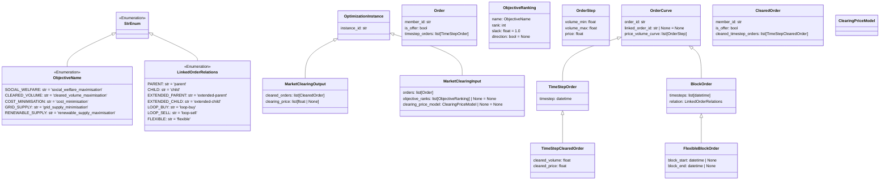

```mermaid
classDiagram

    class MarketClearingOutput {
        cleared_orders: list[ClearedOrder]
        clearing_price: list[float | None]
    }

    class OptimizationInstance {
        instance_id: str
    }

    class ObjectiveName {
        <<Enumeration>>
        SOCIAL_WELFARE: str = 'social_welfare_maximisation'
        CLEARED_VOLUME: str = 'cleared_volume_maximisation'
        COST_MINIMISATION: str = 'cost_minimisation'
        GRID_SUPPLY: str = 'grid_supply_minimisation'
        RENEWABLE_SUPPLY: str = 'renewable_supply_maximisation'
    }

    class LinkedOrderRelations {
        <<Enumeration>>
        PARENT: str = 'parent'
        CHILD: str = 'child'
        EXTENDED_PARENT: str = 'extended-parent'
        EXTENDED_CHILD: str = 'extended-child'
        LOOP_BUY: str = 'loop-buy'
        LOOP_SELL: str = 'loop-sell'
        FLEXIBLE: str = 'flexible'
    }

    class StrEnum {
        <<Enumeration>>
    }

    class BlockOrder {
        timesteps: list[datetime]
        relation: LinkedOrderRelations
    }

    class Order {
        member_id: str
        is_offer: bool
        timestep_orders: list[TimeStepOrder]
    }

    class TimeStepClearedOrder {
        cleared_volume: float
        cleared_price: float
    }

    class ObjectiveRanking {
        name: ObjectiveName
        rank: int
        slack: float = 1.0
        direction: bool = None
    }

    class OrderStep {
        volume_min: float
        volume_max: float
        price: float
    }

    class OrderCurve {
        order_id: str
        linked_order_id: str | None = None
        price_volume_curve: list[OrderStep]
    }

    class FlexibleBlockOrder {
        block_start: datetime | None
        block_end: datetime | None
    }

    class TimeStepOrder {
        timestep: datetime
    }

    class ClearedOrder {
        member_id: str
        is_offer: bool
        cleared_timestep_orders: list[TimeStepClearedOrder]
    }

    class ClearingPriceModel {
    }

    class MarketClearingInput {
        orders: list[Order]
        objective_ranks: list[ObjectiveRanking] | None = None
        clearing_price_model: ClearingPriceModel | None = None
    }


    StrEnum <|-- ObjectiveName
    StrEnum <|-- LinkedOrderRelations
    OrderCurve <|-- TimeStepOrder
    OrderCurve <|-- BlockOrder
    BlockOrder <|-- FlexibleBlockOrder
    OptimizationInstance <|-- MarketClearingOutput
    OptimizationInstance <|-- MarketClearingInput
    TimeStepOrder <|-- TimeStepClearedOrder

```