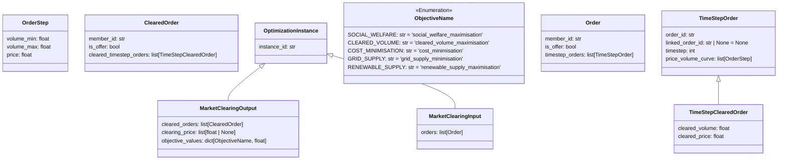

```mermaid
classDiagram

    class MarketClearingOutput {
        cleared_orders: list[ClearedOrder]
        clearing_price: list[float | None]
        objective_values: dict[ObjectiveName, float]
    }

    class OrderStep {
        volume_min: float
        volume_max: float
        price: float
    }

    class ClearedOrder {
        member_id: str
        is_offer: bool
        cleared_timestep_orders: list[TimeStepClearedOrder]
    }

    class OptimizationInstance {
        instance_id: str
    }

    class ObjectiveName {
        <<Enumeration>>
        SOCIAL_WELFARE: str = 'social_welfare_maximisation'
        CLEARED_VOLUME: str = 'cleared_volume_maximisation'
        COST_MINIMISATION: str = 'cost_minimisation'
        GRID_SUPPLY: str = 'grid_supply_minimisation'
        RENEWABLE_SUPPLY: str = 'renewable_supply_maximisation'
    }

    class Order {
        member_id: str
        is_offer: bool
        timestep_orders: list[TimeStepOrder]
    }

    class MarketClearingInput {
        orders: list[Order]
    }

    class TimeStepClearedOrder {
        cleared_volume: float
        cleared_price: float
    }

    class TimeStepOrder {
        order_id: str
        linked_order_id: str | None = None
        timestep: int
        price_volume_curve: list[OrderStep]
    }


    OptimizationInstance <|-- MarketClearingOutput
    OptimizationInstance <|-- MarketClearingInput
    TimeStepOrder <|-- TimeStepClearedOrder

```