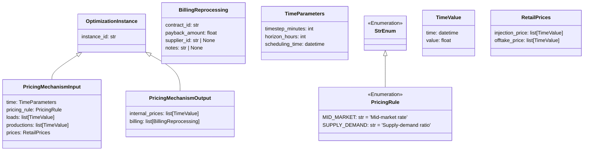

```mermaid
classDiagram

    class OptimizationInstance {
        instance_id: str
    }

    class PricingMechanismOutput {
        internal_prices: list[TimeValue]
        billing: list[BillingReprocessing]
    }

    class PricingMechanismInput {
        time: TimeParameters
        pricing_rule: PricingRule
        loads: list[TimeValue]
        productions: list[TimeValue]
        prices: RetailPrices
    }

    class BillingReprocessing {
        contract_id: str
        payback_amount: float
        supplier_id: str | None
        notes: str | None
    }

    class TimeParameters {
        timestep_minutes: int
        horizon_hours: int
        scheduling_time: datetime
    }

    class PricingRule {
        <<Enumeration>>
        MID_MARKET: str = 'Mid-market rate'
        SUPPLY_DEMAND: str = 'Supply-demand ratio'
    }

    class StrEnum {
        <<Enumeration>>
    }

    class TimeValue {
        time: datetime
        value: float
    }

    class RetailPrices {
        injection_price: list[TimeValue]
        offtake_price: list[TimeValue]
    }


    StrEnum <|-- PricingRule
    OptimizationInstance <|-- PricingMechanismInput
    OptimizationInstance <|-- PricingMechanismOutput

```